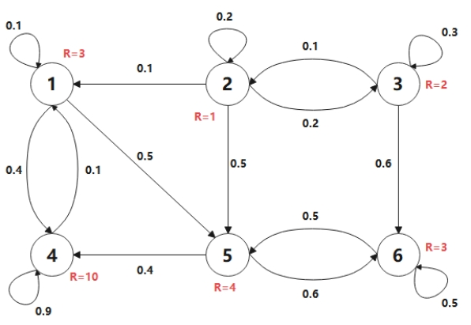
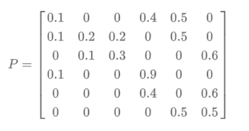
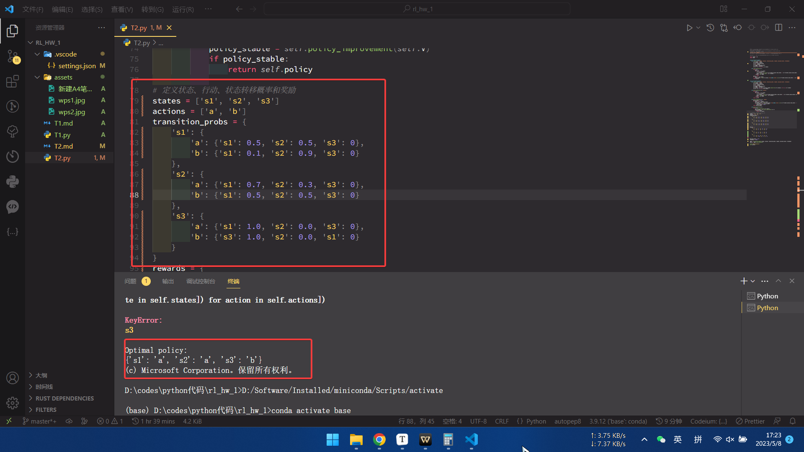

[TOC]

  # 作业1：马尔可夫过程价值函数计算

**计算：马尔可夫奖励过程如下图所示，分别有状态S1~S6，设各状态的价值函数初始值为0，γ=0.9，试根据贝尔曼方程写出第一次和第二次迭代各状态价值的计算过程，可手写拍照或直接电脑编辑，要求过程清晰有说明。**

在马尔可夫奖励过程中，可以使用贝尔曼方程来计算状态值函数。具体而言，可以通过以下方程计算状态 $s$ 的值函数 $V(s)$：

$$
V(s) = \sum_{a}\pi(a|s) \sum_{s',r}p(s',r|s,a)\left[r + \gamma V(s')\right]
$$

其中，$\pi(a|s)$ 表示在状态 $s$ 下采取行动 $a$ 的概率；$p(s',r|s,a)$ 表示从状态 $s$ 执行行动 $a$ 后转移到状态 $s'$ 并获得奖励 $r$ 的概率；$\gamma$ 是折扣因子，用于平衡当前奖励和未来奖励的重要性。

在使用贝尔曼方程进行值函数迭代时，通常会进行两次迭代，以逐步逼近状态值函数的真实值。以下是第一次和第二次迭代各状态价值的计算过程：

第一次迭代：

对于所有的状态 $s \in S$，可以使用贝尔曼方程计算其值函数 $V(s)$：

$$
V^{(1)}(s) = \sum_{a}\pi(a|s) \sum_{s',r}p(s',r|s,a)\left[r + \gamma V^{(0)}(s')\right]
$$
其中，$V^{(0)}(s)$ 表示状态 $s$ 的初始估计值，可以初始化为任何值。

第二次迭代：

对于所有的状态 $s \in S$，可以使用贝尔曼方程计算其值函数 $V(s)$：

$$
 V^{(2)}(s) = \sum_{a}\pi(a|s) \sum_{s',r}p(s',r|s,a)\left[r + \gamma V^{(1)}(s')\right]  
$$

其中，$V^{(1)}(s)$ 表示第一次迭代后状态 $s$ 的估计值。

在本题中，可以认为每一个action都有一个固定的转移状态，如果每一个action都有一个固定的转移状态，那么在计算第一次迭代中的状态值函数时，可以简化贝尔曼方程的计算。

假设在状态 $s$ 下采取行动 $a$ 会使得智能体转移到固定的下一个状态 $s'$，并且获得固定的即时奖励 $r$，则贝尔曼方程可以改写为：

$$
 V^{(1)}(s) = \sum_{a} \pi(a|s) \left[r + \gamma V^{(0)}(s')\right]  
$$

其中，$s'$ 是行动 $a$ 执行后转移到的固定状态，$r$ 是在执行行动 $a$ 后获得的固定即时奖励。

换言之，每个行动 $a$ 的概率 $\pi(a|s)$ 乘上从状态 $s$ 执行行动 $a$ 后的概率 $p(s', r | s, a)$，可以简化为一个常数 $r+\gamma V^{(0)}(s')$。因此，计算状态 $s$ 的值函数只需要对所有行动 $a$ 执行上述步骤，然后对结果求和即可。

需要注意的是，在这种情况下，初始估计值 $V^{(0)}(s')$ 对计算状态值函数没有影响，因为每个行动 $a$ 执行后转移到的下一个状态 $s'$ 是固定的。因此，初始估计值可以设为任何值。

通过不断迭代上述过程，可以逐步逼近状态值函数的真实值。在实际应用中，通常会设定一个收敛条件，当状态值函数的变化量小于某个阈值时，停止迭代。

马尔可夫过程

计算过程如下：

# 作业2：基于动态规划的强化学习算法实现

1. 编程要求：实现`Value Iteration`和`Policy Iteration`两个算法，要求构建`PolicyIterationAgent`和`ValueIterationAgent`类，在这两个Agent类中实现算法，动作为确定性动作或随机性均可，记录获得的平均奖励，观察最后的决策路线。

2. 问答：***根据自己的理解***说说二者算法的区别。

## Value Iteration

1. 定义状态、行动、过渡概率和奖励函数。
2. 将所有状态的`value`初始化为零。
3. 重复进行，直到收敛：
   a. 对于每个状态，计算所有可能行动的预期**reward**。
   b. 将每个状态的`value`更新为最大期望**reward**。
4. 从计算出的值中提取最优政策。

ValueIterationAgent ：

- `__init__(self, states, actions, transition_probs, rewards, discount_factor, threshold)` ： 用给定的参数初始化代理。
- `value_iteration(self)` ： 执行上文所述的价值迭代算法，并返回最优策略。

根据从该状态采取每一种可能的行动所能获得的最大预期**reward**，迭代更新每个状态的价值函数。

一旦价值函数收敛，它就通过选择使预期**reward**最大化的行动来计算每个状态的最优策略。

该算法一直持续到迭代之间价值函数的最大变化小于阈值为止。

运行效果：

## Policy Iteration

1. 定义状态、行动、过渡概率和奖励函数。

2. 初始化一个随机策略。

3. 重复进行，直到收敛：
   a. 通过计算所有状态的值来评估当前政策。
   b. 通过为每个状态选择最佳行动来改进当前策略。

  从最终改进的策略中提取最优策略。

PolicyIterationAgent：

- `__init__(self, states, actions, transition_probs, rewards, discount_factor, threshold)` ： 用给定的参数初始化代理。
- `policy_evaluation(self, policy)` ： 评估给定的策略并返回所有状态的值。
- `policy_improvement(self, values)` ： 根据给定的值改进给定的策略，并返回新的策略。
- `policy_iteration(self)` ： 执行上述的策略迭代算法，并返回最优策略。

## 根据自己的理解说一下二者的区别

马尔可夫过程是一种随机过程，它具有马尔可夫性质，即当前状态的未来只与当前状态有关，而与过去状态无关。ValueIteration和policyIteration都是解决马尔可夫决策过程的方法。ValueIteration是一种迭代算法，它通过迭代计算每个状态的价值函数来得到最优策略。PolicyIteration是另一种迭代算法，它通过迭代计算每个状态的策略函数来得到最优策略。两者的区别在于ValueIteration是先计算出每个状态的价值函数，再根据价值函数得到最优策略；而PolicyIteration是先计算出每个状态的策略函数，再根据策略函数得到最优策略。

# 作业三：Q-learning算法实现

Q-learning算法是一种基于值迭代的强化学习算法，常用于解决马尔可夫决策过程（MDP）的问题。Q-learning算法的目标是学习一个值函数Q(s,a)，该函数可以为每个状态和动作组合提供一个估计的累计奖励值。Q值函数的定义如下：

$$
Q(s,a) = E[R + \gamma * max(Q(s',a'))]
$$
其中，s是当前状态，a是代理采取的动作，R是代理在当前状态下执行动作a后获得的奖励，gamma是一个介于0和1之间的衰减因子，用于折现未来奖励。s'是执行动作a后的下一个状态，a'是在s'状态下可以采取的动作，E表示期望。

Q-learning算法的核心思想是，代理通过与环境交互来逐步更新其Q值函数，使其逼近真实值函数。具体来说，代理在每个时间步t时，根据当前状态s_t，选择一个动作a_t。接着，代理会执行动作a_t，观察环境返回的奖励R_t+1和下一个状态s_t+1。代理根据这些信息来更新其Q值函数，如下所示：

$$
Q(s_t,a_t) \leftarrow Q(s_t,a_t) + \alpha * [R_t+1 + \gamma * max(Q(s_t+1,a)) - Q(s_t,a_t)]
$$
其中，$\alpha$是学习率，用于控制每次更新的幅度。$max(Q(s_t+1,a))$%是下一个状态$s_t+1$中可以采取的所有动作a中的最大Q值。

在训练过程中，代理会不断地与环境交互，并根据观察到的奖励和状态来更新其Q值函数。当Q值函数趋近于真实值函数时，代理的决策将越来越准确。最终，代理可以使用学习到的Q值函数来选择最佳动作，以获得最大的累计奖励。

具体见`T3.py`

## 根据自己的理解说一下二者的区别

Sarsa和Q-learning算法都是基于值迭代的强化学习算法，常用于解决马尔可夫决策过程（MDP）的问题。它们的核心思想都是通过学习一个值函数来指导代理做出决策。然而，它们在值函数的更新方式、采取动作的策略以及对未来奖励的折现方式上存在一些区别。

Sarsa算法使用的是一种基于策略的控制方法，即代理在每个时间步t时，根据当前状态s_t和当前策略来选择一个动作a_t。接着，代理会执行动作a_t，观察环境返回的奖励R_t+1和下一个状态s_t+1，然后根据当前策略在s_t+1中选择下一个动作a_t+1。代理使用这些信息来更新其Q值函数，如下所示：

$$
Q(s_t,a_t) \leftarrow Q(s_t,a_t) + \alpha * [R_t+1 + \gamma * max(Q(s_t+1,a)) - Q(s_t,a_t)]
$$
与Q-learning算法不同的是，Sarsa算法在更新Q值函数时，使用的是下一个状态s_t+1中采取的动作a_t+1的Q值，而不是Q-learning中采用的下一个状态s_t+1中所有动作中的最大Q值。

相比之下，Q-learning算法使用的是一种基于价值的控制方法，即代理在每个时间步t时，根据当前状态s_t和当前Q值函数来选择一个动作a_t。接着，代理会执行动作a_t，观察环境返回的奖励R_t+1和下一个状态s_t+1，然后根据当前Q值函数在s_t+1中选择下一个动作a_t+1。代理使用这些信息来更新其Q值函数，如下所示：

$$
Q(s_t,a_t) \leftarrow Q(s_t,a_t) + \alpha * [R_t+1 + \gamma * max(Q(s_t+1,a)) - Q(s_t,a_t)]
$$
与Sarsa算法不同的是，Q-learning算法在更新Q值函数时，使用的是下一个状态s_t+1中所有动作中的最大Q值，而不是下一个状态中采取的动作a_t+1的Q值。

总的来说，Sarsa算法更加保守，因为它在更新Q值函数时考虑了当前策略下采取的动作，而Q-learning算法则更加乐观，因为它总是选择具有最大Q值的动作。因此，在一些情况下，Sarsa算法可能更容易收敛到一个较为稳定的策略，但是可能会错过一些更优的策略，而Q-learning算法则可能会更容易找到最优策略，但是可能但是可能会在学习初期出现较大的方差，因为它总是选择最大的Q值作为下一步动作，而这个Q值可能在当前状态下被高估。

另外，Sarsa算法在某些情况下能够保证收敛到最优策略，而Q-learning算法则无法保证。这是因为在更新Q值函数时，Q-learning算法总是选择最大的Q值，而不是在当前策略下选择的动作，因此它可能会将一些具有潜在好处的状态-动作对排除在学习过程之外。而Sarsa算法则会考虑所有可能的状态-动作对，因此可以在一些情况下保证最优策略的收敛。